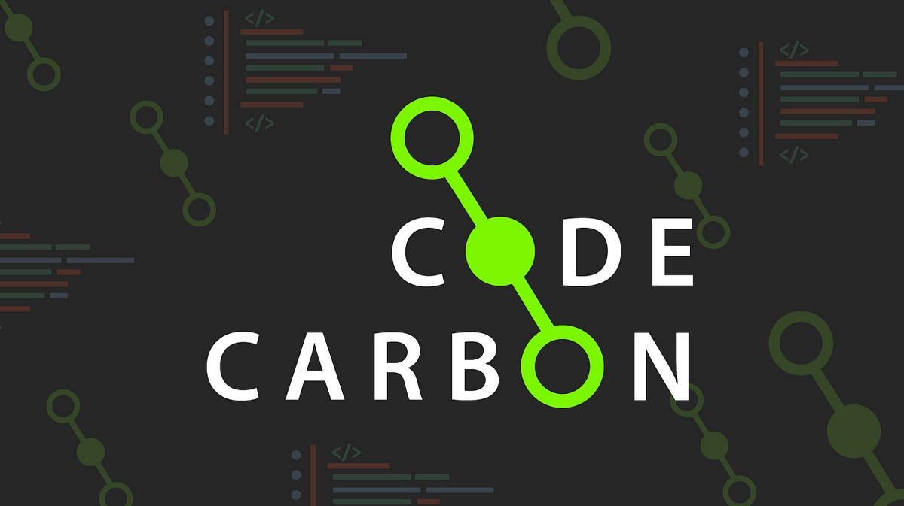

# A Satellite Semantic Segmentation Project with Pytorch using Unet and Attention Unet

### Introduction

### Dataset

### Sample Images & Masks

### Data Augmentation

### Models

### Losses and Metrics

### Training and Validation results

### CO2 Emissions with codecarbon

### Models Explainability with Captum

### How to reproduce the project

### List of Interesting libraries used

| Library          | Logo                                                       | Description |
| :--------------- |:----------------------------------------------------------:| -----------:|
| Pytorch          |        |             |
| Torchmetrics     |   |             |
| captum           |                    |             |
| codecarbon       |            |             |

### References

### License

